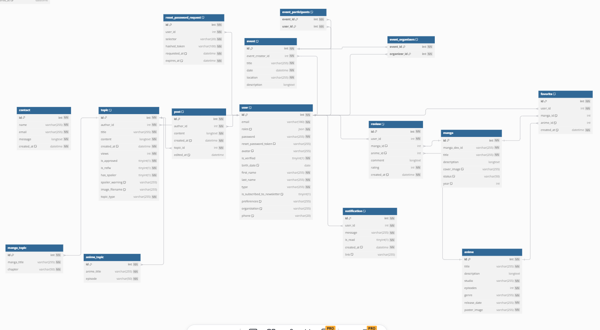

# Mangaquest

## Étapes d'installation

1. **Installer les dépendances :**

   ```bash
   composer install
   ```

2. **Démarrer le serveur Symfony :**
   ```bash
   symfony serve
   ```
3. **Se connecter :**

    ```bash
    php bin/console hautelook:fixtures:load
    ```

- Les identifiants de connexion se trouvent dans `fixtures/user.yaml`.

    email: 'admin@gmail.com'
    password: 'test'
    email: 'user@gmail.com'
    password: 'test'
    email: 'banned@gmail.com'
    password: 'test'

4. **Charger les animes :**
   ```bash
    php bin/console app:fetch-anime
   ```
5. **Charger les mangas :**

   ```bash
    php bin/console app:import-manga
   ```

6. **Test unitaire**

    ```bash
    php bin/console phpunit test/Entity/MangaTest
    ```


7. **Test fonctionnel**

    ```bash
    php bin/console phpunit test/Controller/SecurityControllerTest
    ```

8. **Schéma de la base de données**

